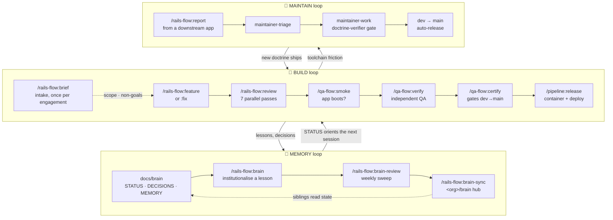

# Architecture — the harness, the three loops, and what we did not adopt

Moved out of the README so that page can answer *what is this and how do I install it* first.
This is the reasoning behind the design, which is worth reading second, not first.
Nothing here changed in the move.

## Architecture — the harness, and three loops

The plugins aren't a bag of commands; they're a **harness**: the scaffolding around the model
that decides what context it gets, what it's allowed to do, how its output is verified, and when
it must stop. Model capability is rarely the limiting factor — the harness is.

Everything below follows from one rule:

> **Put your guarantees in the deterministic layer.**
> Hooks, scripts and gates execute identically every time. A model does not. Anything that must
> *always* happen belongs in a hook or an output contract; prose doctrine can only advise.

That's why the Stop-gate, `release-gate.sh` and the CI drift guard hold, while a rule written
only as guidance eventually gets skipped under pressure.

### The three loops

**BUILD** ships features behind gates. **MEMORY** keeps state outside chat history, so a new
session — or a different machine — resumes without reconstruction. **MAINTAIN** is the loop that
closes back on the toolchain itself: friction found while building becomes an issue here, and the
fix ships as new doctrine.

### Agent topologies

All three multi-agent shapes are in use. The rule is *default sequential; justify parallel*.

Each command **declares** its topology in place, rather than leaving a reader to infer it —
a fan-out declares how conflicting or duplicate outputs merge, a loop declares its exit
condition, and `undeclared-topology` fails the build when one does not. The reasoning, and
why inference was tried first and abandoned, is in
[docs/doctrine/harness-doctrine.md](docs/doctrine/harness-doctrine.md) §8a.

| Topology | Where | Why |
|---|---|---|
| **Sequential** | `/feature` phases · the `doctrine-verifier` gate · `smoke → verify → certify` | Stage N+1 is meaningless if N failed. Cheapest and most debuggable |
| **Parallel** | `/review`'s seven specialist passes · `/qa-flow:verify` Phase 3 | Genuinely independent lenses. Costs scale with fan-out (each subagent re-reads context), so it must be justified |
| **Loop** | `/loop` · the verify → fix → re-verify cycle | Exit is a *property* ("no new findings"), not a step count. Requires circuit breakers |
| **Agent-to-agent** | `/review` Teams mode (`SendMessage`) | Cross-examination. Off by default — independence is a feature; agents that talk can converge on a shared wrong assumption |

### What we deliberately did *not* adopt

Two popular pieces of agentic infrastructure are **intentionally absent**. Both were evaluated
and rejected for the same underlying reason.

**❌ A graph database as the memory/knowledge layer.**
Project memory lives in **plain markdown in git** (`docs/brain/`, plus a shared `<org>/brain`
hub). A graph store would buy richer queries at the cost of the properties this system actually
depends on: memory you can **diff**, **review in a PR**, **grep**, and read without a running
service — and which survives the tool that wrote it. Memory that can't be inspected can't be
trusted, and an agent confidently reciting a stale edge is worse than no memory at all.

**❌ An external orchestration runtime** (DAG engines and similar).
Claude Code already provides the primitives — subagents, hooks, gates, agent teams. Adding a
runtime on top would move control flow *out* of the artefacts you can read and into a framework,
in exchange for capability we already have. The flow is staged and gated; a graph engine wouldn't
make it more correct, only more indirect.

### What we adopted instead — graph engineering without the graph engine

The useful part of "graph thinking" is **typed nodes and explicit edges**, and that needs no
special runtime. Three places where we take it, all as ordinary files in git:

| Instead of | We use | What it buys |
|---|---|---|
| Prose hand-offs between parallel agents | **Typed findings records** (JSONL: severity, `file:line`, a stable dedupe `signature`, `caused_by` / `blocks`) | Dedupe becomes mechanical; completeness becomes checkable (every input id must appear in the output); fixes order **topologically** so root causes precede symptoms |
| Prose "this blocks that" inside issue bodies | **Declared issue edges** (`depends-on` / `blocks` / `part-of`) | Triage *computes* the ready-now set and the critical path instead of re-deriving it by hand |
| Judged regression scope | **Code graph for blast radius** (`qa-flow/scripts/blast_radius.py`) — changed file → reverse dependencies → routes → tests | Test selection is derived and justifiable — every inclusion prints the edge that justified it — with a convention-based fallback when no graph tool is installed |

Same benefits — deterministic merges, computed ordering, derived scope — with state that stays
greppable, diffable and reviewable. The graph is in the **data**, not in a database.

## The skills

| Skill | What it encodes | References |
|---|---|---|
| **`rails-8`** | The full Rails 8.1.x doctrine: vanilla-first stack (built-in auth, Solid Queue/Cache/Cable, Propshaft + importmap, Kamal 2), models → controllers → views workflow, **pure RSpec** testing (a deliberate standardization over Rails' Minitest default; no matcher add-ons), OpenAPI docs via rswag, AI features via ruby_llm, observability, advanced Active Record, ecosystem gems | 16 reference files |
| **`hotwire`** | The Hotwire stack from the official handbooks: Turbo 8 (Drive, morphing refreshes, Frames, Streams), Stimulus 3.2 (full controller reference), and **Hotwire Native** (iOS/Android shells, path configuration, bridge components) | 3 reference files |
| **`design-system`** | The design system: Tailwind v4 `@theme` token architecture (brand primitives → semantic roles → Utopia fluid scale), Every-Layout composition primitives, a ~16-component catalog (variant×size×state), Stimulus interaction patterns, responsive doctrine, mobile (Hotwire Native + native token export) parity, reference implementations (ViewComponent + Stimulus mixin + Hotwire-Native + native-token-export code), a **data-visualization layer** (validated `fm-*`-derived chart palette, KPI + chart recipes, chart a11y), and the two-brand model — so UI is consistent across web, Android, and iOS without a designer/Figma | 14 reference files (incl. worked implementations for the full component catalog, modal-driven CRUD, and data-viz) |

They cross-reference each other — install all three for Rails + UI work (all ride in `rails-stack`).

### House rules baked in

- Rails **8.1.x**, "the Rails way": convention over configuration, server-rendered HTML, one-person-framework defaults.
- **Testing is RSpec only.** Apps are scaffolded with `rails new --skip-test`; the stack is rspec-rails + FactoryBot + Faker + Capybara + SimpleCov + WebMock/VCR, with pure RSpec matchers (no shoulda-matchers).
- **No gems from categories Rails 8 eliminated**: the built-in authentication generator (not auth engines), Solid Queue (not external job backends), Solid Cache/Cable (not Redis).
- REST APIs are documented with **OpenAPI** — rswag as the test-driven default.
- AI/LLM features use **ruby_llm** (chat, tools, structured output, embeddings, `acts_as_chat`).
- Deployment is **Kamal 2** on plain servers.
